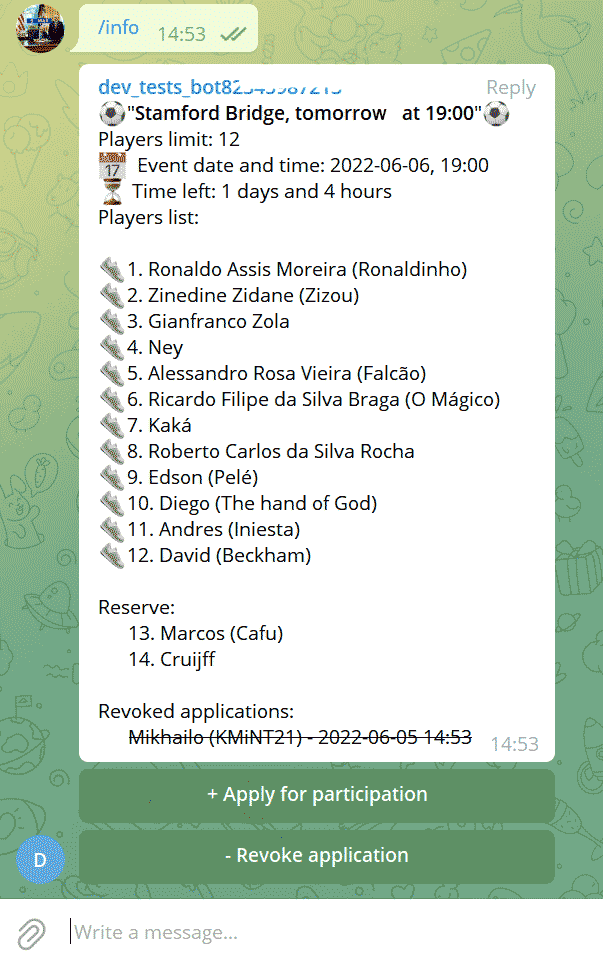

# Telegram Bot for organizing sport or any other events for small groups

## About

The bot will maintain a list of participants for you, giving you the opportunity to sign up for an event simply by clicking on one button. And also cancel your application for participation. (In this case, the canceled order will also be displayed at the bottom in a separate block, and the date and time of the cancellation of the order will be shown next to it).



If you set a limit on the number of participants (using the **/limit X** command), then the bot will place in the second "Reserve" list all those who did not manage to get into the main list.

An event is created with just one command: **/event_add TEXT** If you set the date and time in the text (it can be in any form, the bot can handle it), then the event description will always display the date and time, as well as how much time is left before the start.

You can set the date and time later with a separate command: **/event_datetime datetime** To maintain statistics on participants, completed events can be fixed with the **/fix** command.

Then the **/stat** command will display data on group members. Specifically, the number of registrations for events and the number of penalty points. Penalty points can be assigned to users with the **/penalty USERID** command, for example, for missing events without canceling the application in a timely manner. Used only to mark the most irresponsible users. If the application/penalty ratio is poor, a yellow card (one, two or three) will be displayed next to the username.

In addition to English, Ukrainian, Russian and Portuguese languages are also supported.

You can just use this bot on my server (it's available for now by telegram name [@zp_futsal_bot](https://telegram.me/zp_futsal_bot)). Just invite bot to your group. Or install your bot version on your server.

## Installation

First of all you need Python 3.6+. Then follow these steps:

1. Clone the repo

   ```sh
   git clone https://github.com/KMiNT21/telegram_sport_event_bot.git

   ```

2. Get a free TELEGRAM BOT TOKEN (Start dialog with [BotFather](https://telegram.me/botfather) and follow instructions). Save token in token.txt file inside project's folder.

3. Install requirements by command

   ```sh
   pip install -r requirements.txt
   ```

4. Run 'python db.py' once to create new database.

   ```sh
   python db.py
   ```

5. Run 'python  sport_event_bot.py'.

    ```sh
   python  sport_event_bot.py
   ```
